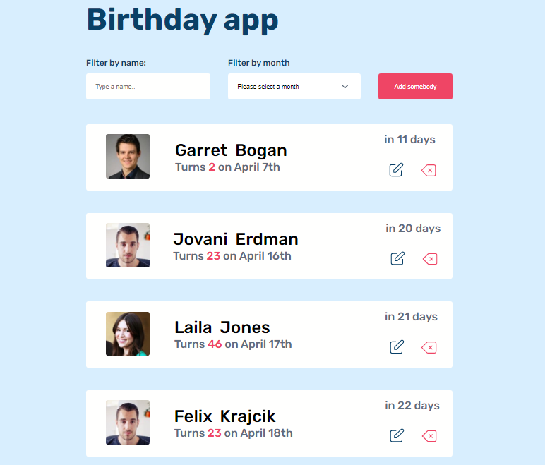

# Birthday app
- **Screenshot**
    

- **Figma design**
    
    - See the [figma design here]('https://www.figma.com/file/bb1Mie5R3mUhR77PtGG8bJ/Birthday-App?node-id=7%3A72')
    
## structure
In this project, we created:
- **A form that contains**:
        -  input where users can filter a name.
        -  A dropdown where users can select a month.
        -  A button which users can click when they want to add a person's information. A popup will  appear when the button is clicked, and will show a form that the user can fill with the person's picture, first name, last name, and date of birth.  
- **An element that contains**:
        -  lists of data from API. Each list has picture, names, date of birth of a person, and `edit`/ `delete` button.
            - Edit: (clicking the edit button will show a popup where users can edit the information from the list.)
            - Delete: (clicking this button will show the users a popup will ask them whether they want to remove that person from the list or not.

## Challenge
- This project's built only with html, css and Vanilla javascript. 
- we fetched data from an Api to get pictures, names and date.
- The goal was letting users to be able to filter names, select a month, add new person, and remove a list or edit a list.
- The design also needed to match the design from figma.(View again my screenshot above and the real design below it).
- We also installed `date-fns` to handle date computations.
- Every action is persisted into the local storage.

